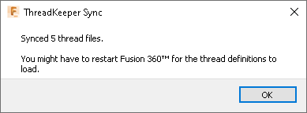
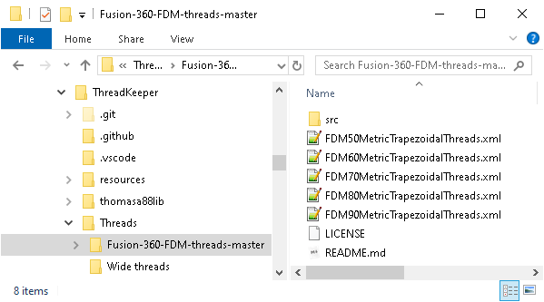

#  ThreadKeeper

ThreadKeeper is an Autodesk® Fusion add-in that restores [custom thread definitions](https://knowledge.autodesk.com/support/fusion-360/learn-explore/caas/sfdcarticles/sfdcarticles/Custom-Threads-in-Fusion-360.html) every time they are removed (i.e. when Fusion is updated).

Thread definitions to restore are put in the *Threads* directory of ThreadKeeper.

Every time Fusion starts, ThreadKeeper checks if thread definition files are missing. In that case, the files are restored.

## Supported Platforms

* Windows
* Mac OS

## Installation

Download the add-in from the [Releases](https://github.com/thomasa88/ThreadKeeper/releases) page.

Unpack it into `API\AddIns` (see [How to install an add-in or script in Fusion 360](https://knowledge.autodesk.com/support/fusion-360/troubleshooting/caas/sfdcarticles/sfdcarticles/How-to-install-an-ADD-IN-and-Script-in-Fusion-360.html)).

Make sure the directory is named `ThreadKeeper`, with no suffix.

## Usage

Start by storing thread definitions inside ThreadKeeper's threads directory. Open the directory by clicking *UTILITIES* -> *THREADKEEPER* -> *Open ThreadKeeper directory*.

If you already have thread definitions added to Fusion that you want to keep, open the Fusion threads directory and copy them to ThreadKeeper's threads directory.

Note that the files in ThreadKeeper's directory can be stored in a nested fashion (i.e. inside multiple directories). Note, however, that the file structure will be flattened when copied to the Fusion threads directory.

ThreadKeeper will sync the files every time Fusion starts

To copy the files to Fusion directly, click *Force sync*.

To change which directory where threads are stored within ThreadKeeper, click *Change ThreadKeeper directory...*.

The add-in can be temporarily disabled using the *Scripts and Add-ins* dialog. Press *Shift+S* in Fusion and go to the *Add-Ins* tab.

## How do I get threads?

This add-in does not contain any thread definitions.

You can either create custom definitions yourself. See [Creating custom threads and thread standards in Fusion 360](https://knowledge.autodesk.com/support/fusion-360/learn-explore/caas/sfdcarticles/sfdcarticles/Custom-Threads-in-Fusion-360.html).

You can also download definitions that others have made.

Examples:

* [Fusion-360-FDM-threads](https://github.com/dans98/Fusion-360-FDM-threads)
* [CustomThreads](https://github.com/BalzGuenat/CustomThreads)

## Known Limitations

None.

## Reporting Issues

Please report any issues that you find on the [Issues](https://github.com/thomasa88/ThreadKeeper/issues) page.

For better support, please include the steps you performed and the result. Also include copies of any error messages.

## Author

This add-in is created by Thomas Axelsson.

## Contributors

* Sune Trudslev

## License

This project is licensed under the terms of the MIT license. See [LICENSE](LICENSE).

## More Fusion Add-ins

[My Fusion app store page](https://apps.autodesk.com/en/Publisher/PublisherHomepage?ID=JLH9M8296BET)

[All my add-ins on Github](https://github.com/topics/fusion-360?q=user%3Athomasa88)

## Changelog

* v 1.2.1
  * Fix for start-up error due to Utilites Tab not being loaded. Contributed by Sune Trudslev.
  * Fix problem loading add-in in Fusion Insider Preview.
* v 1.2.0
  * Option to change threads directory.
* v 1.1.0
  * Support for Mac
* v 1.0.0
  * Initial release