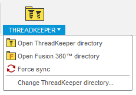

#  ThreadKeeper

ThreadKeeper is an Autodesk® Fusion 360™ add-in that restores custom thread definitions every time they are removed (i.e. when Fusion 360™ is updated).

Thread definitions to restore are put in the *Threads* directory of ThreadKeeper.

Every time Fusion 360™ starts, ThreadKeeper checks if thread definition files are missing. In that case, the files are restored.

## Installation
Download the add-in from the [Releases](https://github.com/thomasa88/ThreadKeeper/releases) page.

Unpack it into `API\AddIns` (see [How to install an add-in or script in Fusion 360](https://knowledge.autodesk.com/support/fusion-360/troubleshooting/caas/sfdcarticles/sfdcarticles/How-to-install-an-ADD-IN-and-Script-in-Fusion-360.html)).

Make sure the directory is named `ThreadKeeper`, with no suffix.

## Usage

Start by storing thread definitions inside ThreadKeeper's threads directory. Open the directory by clicking *TOOLS* -> *THREADKEEPER* -> *Open ThreadKeeper directory*.

If you already have thread definitions added to Fusion 360™ that you want to keep, open the Fusion 360™ threads directory and copy them to ThreadKeeper's threads directory.

Note that the files in ThreadKeeper's directory can be stored in a nested fashion (i.e. inside multiple directories). Note, however, that the file structure will be flattened when copied to the Fusion 360™ threads directory.

ThreadKeeper will sync the files every time Fusion 360™ starts

To copy the files to Fusion 360™ directly, click *Force sync*. 

The add-in can be temporarily disabled using the *Scripts and Add-ins* dialog. Press *Shift+S* in Fusion 360™ and go to the *Add-Ins* tab.

## Known Limitations

None.

## Author

This add-in is created by Thomas Axelsson.

## License

This project is licensed under the terms of the MIT license. See [LICENSE](LICENSE).

## Changelog

* v 1.0.0
  * Initial release